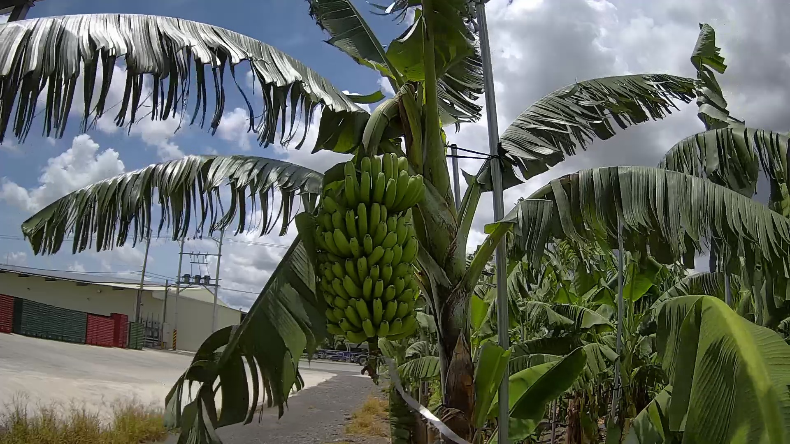
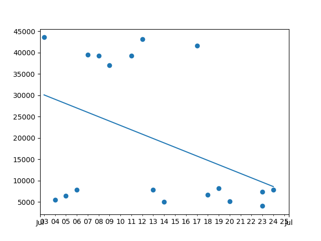
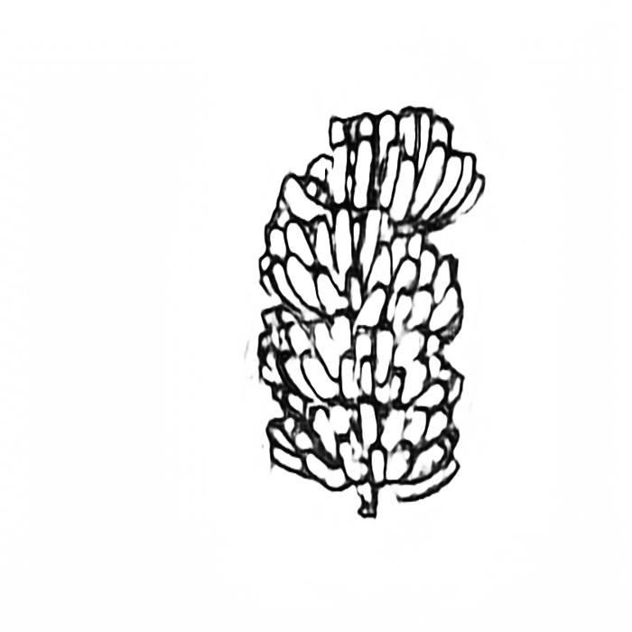
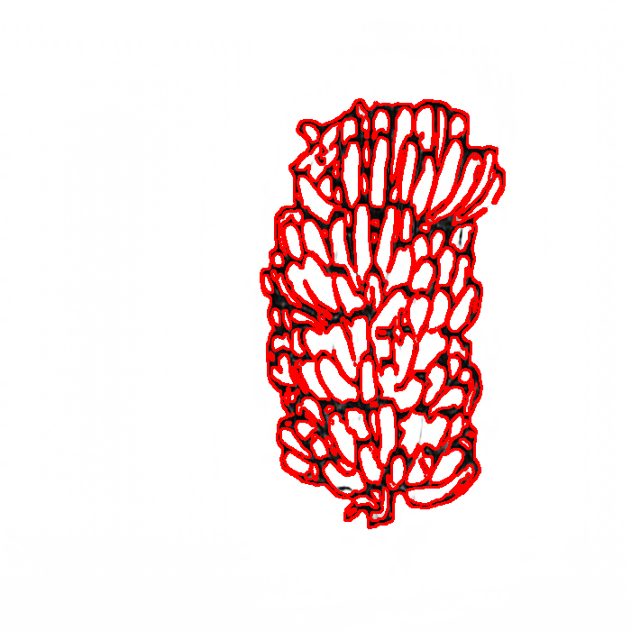

## 一、系統 / 程式目的
透過香蕉園中的Speed Dome攝影機拍攝，搭配電腦影像處理技術，追蹤香蕉生長情形變化。

## 二、輸入 / 輸出規格
### 輸入
此系統為初代版本，需要的輸入為
<b>同一鏡頭定點、旋轉角度、放大倍率。多張不同日期、時間的Speed Dome香蕉園高清影像。
</b>
<p>檔名格式：image_日-月-年_時-分-秒_AM(PM).jpg(png)</p>

#### 範例




### 輸出
香蕉體積變化的趨勢。如下圖：


## 三、系統 / 程式操作說明

### 步驟一
將預進行邊緣偵測的圖片


放入images/original/：


### 步驟二
打開command line，將工作目錄移至<b>專案根目錄</b>下：
```shell
    cd ./xxxx/Banana_Volume_Estimation/
```
輸入執行指令：

```shell
    python3 main
```


按下enter後，可以看到系統正在處理圖片運算


大約5分鐘後會電腦就會自動跑出香蕉體積趨勢圖


並且會將趨勢圖存在當下目錄，並命名為scatter.png


## 四、系統 / 程式流程


## 五、演算法的使用
### 1.邊緣偵測(一) -- DexiNed：

DexiNed (Dense Extreme Inception Network for Edge Detection)


香蕉結果圖像，產出於 image/edged_img/ 資料夾中。如下圖：



### 2.邊緣偵測(二) -- OpenCV Canny Filter：
The successive steps of the Canny filter


香蕉結果圖像，如下圖：


### 3.輪廓尋找 -- OpenCV findContours()：
參數選擇 cv2.RETR_EXTERNAL，只留下外圍的輪廓。
<b>圖例說明：</b>


香蕉結果圖像，如下圖：


### 4.篩選香蕉輪廓：
篩選條件：
* 輪廓圍起來的面積 > 前25%位數
* 輪廓圍起來的面積 < 平均+0.25倍的標準差
* 輪廓周長 < 600 pixels

香蕉結果圖像，產出於 image/result_pics/ 資料夾中。如下圖：


### 5.計算單根香蕉的平均體積：
#### 5.1
我們由 cv2.contourArea() 得到封閉曲線面積。
#### 5.2
由於面積 Area (A) 正比於邊長的平方，體積 Volume (V) 正比於邊長的三次方。
故我們將面積 Area (A) 開根號，再乘上三次方，求得體積 Volume (V) 的相對數值。

#### 5.3
將所有體積加總後，平均。

### 6.將單根香蕉的平均體積相對日期時間作圖，並計算回歸線


## 成效、檢討及未來改進方向
### 成效：
由此初代香蕉生長情形變化追蹤系統，可以做到將香蕉園的<b>來源影像</b>
，透過多層影像處理技術，將單根香蕉的<b>體積</b>估算出來。

並且依據估算的香蕉體積，相對日期時間作圖，得到<b>香蕉成長趨勢圖</b>及其<b>成長回歸曲線</b>。

### 檢討：
#### 1.
來源圖片分成<b>白天、晚上</b>兩種影像。晚上的香蕉園影像為紅外線攝 影，顏色對比較明顯，使用本系統/程式運算，可得到相較白天影 像，<b>更準確</b>的香蕉輪廓選取。 故未來需要將<b>白天</b>影像的輪廓選取效果，提升至夜晚影像的輪廓選 取水準。

#### 2.
輪廓的篩選條件<b>尚未最佳化</b>，有時會抓取到背景的雜物;而為了刪 除雜物所設立的篩選條件往往過於嚴苛而無法獲取<b>足夠數量</b>的香蕉 輪廓。如下圖:



#### 3.
每張圖片選取的香蕉輪廓，平均面積大小較不規則。換算體積後， 儘管落點與時間呈現正向成長關係，不過各點與回歸線間的誤差仍 需要被縮小。

### 未來改進方向:
#### 1.
可加入使用<b>物件辨識演算法(如:YOLO)</b>，自動框選來源圖片中的<b>香蕉串</b>位置。

#### 2.
在香蕉園的拍攝地點，設置<b>比例尺</b>;在作影像<b>面積判定</b>上，可得到 更精確數值，不受鏡頭縮放比例不同影響。

#### 3.
加長香蕉園攝影<b>期間</b>，並縮短擷取影像的<b>時間間隔</b>(更多來源影像)，以達到更精確的描點作圖。
